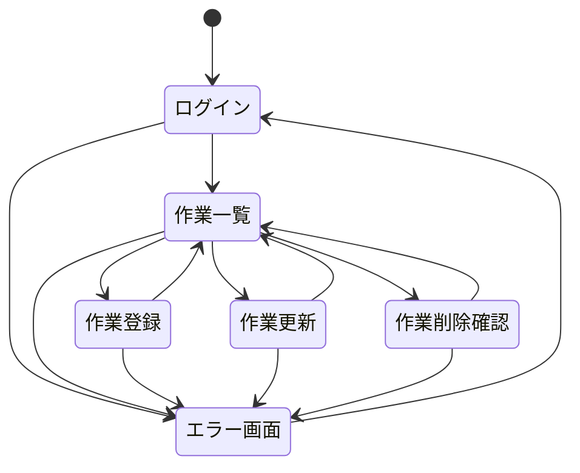

# Web アプリケーション作成課題

下記の仕様に従って　共有型Todo管理アプリケーションを作成してください

## システムの目的

- チーム内で各メンバーの作業(Todo)を一元管理したい
- 作業には期限と担当者を設け、いつ完了したのかを把握したい
- チーム内のメンバーだけがアクセスできるようにしたい

## システムの要件

### 必要要件

- 登録されたユーザーだけがアクセスできること
- 項目名と期限、担当者を入力して作業を登録できること
- 担当者は登録されているユーザーから選択できること
- 登録されている作業を一覧で確認できること
- 一覧は期限の古いものから並べ、期限を過ぎても完了していないものを分かりやすく表示すること
- 項目名または担当者名の一部から作業の検索ができること
- 一覧から作業の完了／未完了の切替ができること
- 登録されている作業の内容を変更できること
- 登録されている作業を選択して削除できること

以下は可能であれば追加で実装してください

- 管理者はユーザーの登録・削除・登録情報の修正ができること

### 管理する情報

- ユーザー情報
    - ログインユーザー名
    - パスワード
    - 姓
    - 名
    - 管理者権限の有無

- 作業項目
    - 項目名
    - 担当者
    - 登録日
    - 期限日
    - 完了日（入っていなければ未完了とみなす）

### 使用できる端末

- PC（ブラウザ）

### データベース

- MySQL を使用

## システムの機能

### ログイン・ログアウト機能

- ログインユーザー名とパスワードで認証を行う
- 認証されたユーザーだけにアプリケーションの利用を許可する
- ログインせずにアプリケーションにアクセスしたら、ログインを促す
- ログインしているユーザーの姓名を画面上に表示する
- ログアウトしたらアプリケーションの利用を終了し、再度ログインを促す

### 一覧表示機能

- 登録されている作業を一覧で表示する
- 一覧には項目名、担当者の姓名、登録日、期限日、完了日を表示する
- 一覧は期限の古いものから並べる
- 期限を過ぎても完了していないものは目立つ色で表示する

### 検索機能

- 入力した文字が項目名または担当者名の一部に一致する作業だけを一覧に表示する

### 作業登録機能

- 項目名、期限日、担当者を入力して作業をデータベースに登録する
- 担当者は登録されているユーザーから選択して入力する
- 項目名は100文字以下とする
- 登録日には登録が行われた当日の日付をセットする
- 完了日には何もセットしない

### 完了状態切替機能

- 一覧上で各作業項目の完了/未完了の状態を切り替える
- 完了に切り替えたときは完了日にその日付をセットし、未完了に切り替えたときは完了日を消す

### 作業更新機能

- 選択した作業の項目名、期限日、担当者、完了状態を更新する
- 完了状態を切り替えたときの完了日の更新は完了状態切替機能に準じる

### 作業削除機能

- 選択した作業を削除する
- 物理削除ではなく論理削除とする
- 削除した作業は一覧には表示せず、検索対象からもはずす

### （追加機能）ユーザー管理機能

※この機能を実装しないときは、ユーザー情報はあらかじめデータベースに直接登録しておく

- ユーザー情報の登録・閲覧・更新・削除を行う
- 管理者のみが利用できる

### （追加機能）ページネーション機能

- 作業一覧は1ページ10件ずつ表示する

## 画面

### 画面一覧

1. ログイン画面
1. 作業一覧画面
1. 作業登録画面
1. 作業更新画面
1. 作業削除確認画面
1. エラー画面

### 画面遷移図

### ログイン画面

- ログインユーザー名とパスワードを入力し、ログインボタン押下で認証を行う
- 認証に成功すれば作業一覧画面を開く
- 認証に失敗すれば再度ログイン画面を開き「ユーザー名またはパスワードが違います」と表示する
- ログインしていないときは、どこにアクセスしてもこの画面を表示する

### 作業一覧画面

- 削除されていない作業を期限日の古いものから一覧で表示する（期限日の昇順）
- 期限を過ぎても完了していない項目は目立つ色で表示する
- 検索ボックスを用意し、そこに文字を入力してエンターを押すと、入力した文字が項目名または担当者の姓、名含まれる項目を一覧に表示する（その際、検索ボックスには入力した文字をそのまま残す）
- 作業登録を用意し、押すと作業登録画面を開く
- 各項目に更新ボタンを用意し、押すとその項目の作業更新画面を開く
- 各項目の削除ボタンを用意し、押すとその項目の作業削除確認画面を開く
- 未完了の項目には完了ボタンを、完了の項目には未完了ボタンを用意し、押すとその項目の完了状態を切り替えてから同じ画面を表示する
- 更新/削除/完了/未完了ボタン押下時に該当する作業項目が存在しなかった場合は、エラー画面を開きエラーメッセージを表示する

### 作業登録画面

- 項目名、担当者、期限を入力し、新規作業を登録する
- 担当者入力欄はセレクトボックスとし、登録されているユーザーを選択肢とする
- 登録ボタンを押すと下記のバリデーションを行ってから登録処理を行う
    - 項目名：必須、100文字以内
    - 担当者：必須、登録されているユーザーであること
    - 期限日：必須、正しい日付であること
- バリデーションエラーがあった場合は入力内容を残したまま同じ画面を表示し、エラーのあった項目にエラーメッセージを表示する
- 登録に成功したら、作業一覧画面にリダイレクトする
- キャンセルボタンを押すと何も行わずに作業一覧画面にリダイレクトする

### 作業更新画面

- 選択された作業の登録内容（項目名、担当者、期限、完了状態）を更新する
- 各入力項目には現在の登録内容をデフォルト値としてセットする
- 担当者入力欄はセレクトボックスとし、登録されているユーザーを選択肢とする
- 完了状態はチェックボックスとし、完了日がセットされていればチェックを入れる
- 更新ボタンを押すと下記のバリデーションを行ってから更新処理を行う
    - 項目名：必須、100文字以内
    - 担当者：必須、登録されているユーザーであること
    - 期限日：必須、正しい日付であること
- バリデーションエラーがあった場合は入力内容を残したまま同じ画面を表示し、エラーのあった項目にエラーメッセージを表示する
- 更新に成功したら、作業一覧画面にリダイレクトする
- キャンセルボタンを押すと何も行わずに作業一覧画面にリダイレクトする

### 作業削除確認画面

- 削除したい作業の内容を確認してから削除する
- 選択された作業の登録内容（項目名、担当者、期限、完了状態）を表示する
- 削除ボタンを押したら該当の作業を削除し、作業一覧画面にリダイレクトする
- キャンセルボタンを押すと何も行わずに作業一覧画面にリダイレクトする

### エラー画面

- データベースのエラーで例外が発生したなど、予期せぬエラーが発生したときに表示する
- ログアウトボタンを押すとログアウトし、ログイン画面を表示する

### 共通ヘッダ

- ログイン画面とエラー画面以外には共通のヘッダを表示する
- ヘッダには画面名、ログインユーザの姓名、ログアウトボタンを表示する
- ログアウトボタンを押すとログアウトし、ログイン画面を表示する

## テーブル定義

MySQL を使用し、データベース名は todo としてください

※ LaravelやDjangoでO/Rマッパー（モデルからテーブルを自動作成）を利用する場合は、テーブル名を下記に合わせなくても構いません

### テーブル一覧

|#|論理テーブル名|物理テーブル名|
|---|---|---|
|1|ユーザーテーブル|users|
|2|作業項目テーブル|todo_items|

### ユーザーテーブル

|カラム名|データ型|Not Null|デフォルト|備考|
|---|---|---|---|---|
|id|int AUTO_INCREMENT|Yes| |PRIMARY_KEY|
|user|varchar(50)|Yes| |ログインユーザー名 ユニークに設定する|
|pass|varchar(255)|Yes| |パスワード ハッシュ化した値をセットする|
|family_name|varchar(50)|Yes| |ユーザー姓|
|first_name|varchar(50)|Yes| |ユーザー名|
|is_admin|tinyint(1)|Yes|0|管理者権限 0:なし, 1:あり|
|is_deleted|tinyint(1)|Yes|0|削除フラグ 0:未削除, 1:削除|
|create_date_time|datetime|Yes|CURRENT_TIMESTAMP|レコード登録日時|
|update_date_time|datetime|Yes|CURRENT_TIMESTAMP on update CURRENT_TIMESTAMP|レコード更新日時|

### 作業項目テーブル

|カラム名|データ型|Not Null|デフォルト|備考|
|---|---|---|---|---|
|id|int AUTO_INCREMENT|Yes| |PRIMARY_KEY|
|user_id|int|Yes| |ユーザーID ユーザーテーブルの外部キー|
|item_name|varchar(100)|Yes| |項目名|
|registration_date|date|Yes| |登録日|
|expire_date|date|Yes| |期限日|
|finished_date|date| | |完了日 NULLのとき未完了とする|
|is_deleted|tinyint(1)|Yes|0|削除フラグ 0:未削除, 1:削除|
|create_date_time|datetime|Yes|CURRENT_TIMESTAMP|レコード登録日時|
|update_date_time|datetime|Yes|CURRENT_TIMESTAMP on update CURRENT_TIMESTAMP|レコード更新日時|
