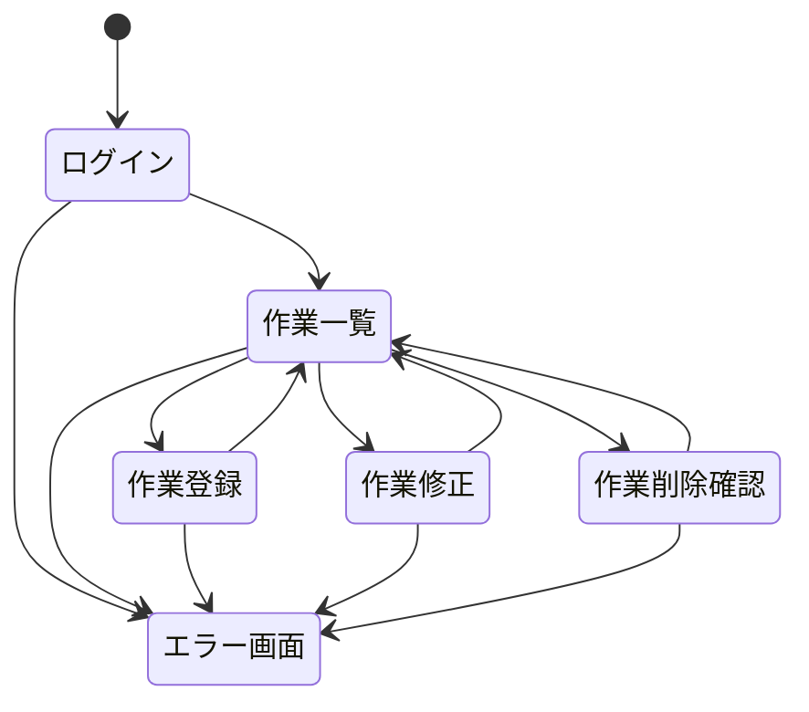

# Web アプリケーション作成課題

## 目次

- [はじめに](#はじめに)
- [システムの目的](#システムの目的)
- [システムの要件](#システムの要件)
    - [必要要件](#必要要件)
    - [管理する情報](#管理する情報)
    - [使用できる端末](#使用できる端末)
    - [使用技術](#使用技術)
- [システムの機能](#システムの機能)
    - [ログイン・ログアウト機能](#ログインログアウト機能)
    - [一覧表示機能](#一覧表示機能)
    - [検索機能](#検索機能)
    - [作業登録機能](#作業登録機能)
    - [完了状態切替機能](#完了状態切替機能)
    - [作業修正機能](#作業修正機能)
    - [作業削除機能](#作業削除機能)
    - [(追加機能)ユーザー管理機能](#追加機能ユーザー管理機能)
    - [(追加機能)ページネーション機能](#追加機能ページネーション機能)
- [画面](#画面)
    - [画面一覧](#画面一覧)
    - [画面遷移図](#画面遷移図)
    - [ログイン画面](#ログイン画面)
    - [作業一覧画面](#作業一覧画面)
    - [作業登録画面](#作業登録画面)
    - [作業修正画面](#作業修正画面)
    - [作業削除確認画面](#作業削除確認画面)
    - [エラー画面](#エラー画面)
    - [共通ヘッダ](#共通ヘッダ)
- [テーブル定義(PHP, サーブレット, SpringBoot)](#テーブル定義phpサーブレットspringboot)
    - [テーブル一覧](#テーブル一覧)
    - [ユーザーテーブル](#ユーザーテーブル)
    - [作業項目テーブル](#作業項目テーブル)
- [テーブル定義(Laravel)](#テーブル定義laravel)
    - [モデル一覧](#モデル一覧)
    - [usersテーブル](#users-テーブル)
    - [todo_itemsテーブル](#todo_items-テーブル)

## はじめに

下記の仕様に従って、共有型Todo管理アプリケーションを作成してください。

HTMLの[モックアップ](https://github.com/shibamirai/shared_todo_lists/tree/main/%E3%83%A2%E3%83%83%E3%82%AF%E3%82%A2%E3%83%83%E3%83%97)が用意してあるので、画面はそれを元に作成してください。モックアップにはBootstrap版とTailwindCSS版があるので、LaravelではTailwindCSS版を、それ以外の言語ではBootstrap版を使用してください。

また、言語別に以下の制約事項に従ってください。

- Spring Boot
    - JPAではなくMyBatisを使用してください
    - モックアップではBootstrapをCDNで利用していますが、CDNではなくプロジェクトに直接Bootstrapを導入してください

- Laravel
    - AIに頼らないよう、Laravel Boostはインストールしないでください
    - ビルトイン認証(Authentication)は使用せず、ログイン・ログアウト処理は自分で実装してください
      その際、ログインユーザー名にはメールアドレスを使用するようにしてください
    - 完了状態切替機能はLivewireを使用して実装してください
    - モックアップではTailwindCSSをCDNで利用していますが、CDNではなくプロジェクト内のTailwindCSSを使用してください
    - TailwindCSS版モックアップでは[daisyUI](https://daisyui.com/)を使用しています
    [このサイト](https://daisyui.com/docs/install/laravel/)に従ってプロジェクトにdaisyUIをインストールして使用してください

- Django
    - ユーザーはデフォルトのまま使用せず、拡張ユーザーモデルを利用してください
      その際、ログインユーザー名にはメールアドレスを使用するようにしてください
    ※「現場で使えるDjangoの教科書」1.4, 1.5を参照
    - モックアップではBootstrapをCDNで利用していますが、CDNではなく、「現場で使えるDjangoの教科書」第2章を参考にプロジェクトをBootstrapに対応させてください
    ただしBootstrap5の場合はdjango-bootstrap4ではなくdjango-bootstrap5となるのでインストール時の設定の違いなどを調べて導入してください

## システムの目的

- チーム内での各メンバーの作業(Todo)を一元管理したい
- 各作業の期限と担当者を確認し、いつ完了したのかを把握したい
- チーム内のメンバーだけで情報を共有したい

## システムの要件

### 必要要件

- 登録されたユーザーだけがアクセスできること
- 項目名と期限、担当者を入力して作業を登録できること
- 担当者は登録されているユーザーから選択できること
- 登録されている作業を一覧で確認できること
- 一覧は期限の古いものから並べ、期限を過ぎても完了していないものを分かりやすく表示すること
- 項目名または担当者名の一部から作業の検索ができること
- 各作業の完了／未完了状態の切替が簡単にできること
- 登録されている作業の内容を修正できること
- 選択した作業をシステムから削除できること

以下は可能であれば追加で実装してください

- 管理者によってユーザーの登録・削除・登録情報の修正ができること

### 管理する情報

- ユーザー情報
    - ログインユーザー名
    - パスワード
    - 姓
    - 名
    - 管理者権限の有無

- 作業項目
    - 項目名
    - 担当者
    - 登録日
    - 期限日
    - 完了日（入っていなければ未完了とみなす）

### 使用できる端末

- PC（ブラウザ）

### 使用技術

- データベース：MySQL
- CSSフレームワーク：Bootstrap または TailwindCSS

## システムの機能

### ログイン・ログアウト機能

- ログインユーザー名とパスワードで認証を行う
- 認証されたユーザーだけにアプリケーションの利用を許可する
- ログインせずにアプリケーションにアクセスしたら、ログインを促す
- ログインしているユーザーの姓名を画面上に表示する
- ログアウトしたらアプリケーションの利用を終了し、再度ログインを促す

### 一覧表示機能

- 登録されている作業を一覧で表示する
- 一覧には項目名、担当者の姓名、登録日、期限日、完了日を表示する
- 一覧は期限の古いものから並べる
- 期限を過ぎても完了していないものは目立つ色で表示する

### 検索機能

- 入力した文字が項目名または担当者名の一部に一致する作業だけを一覧に表示する

### 作業登録機能

- 項目名、期限日、担当者、完了状態を入力して作業をデータベースに登録する
- 担当者は登録されているユーザーから選択して入力する
- 項目名は100文字以下とする
- 登録日には登録が行われた当日の日付をセットする
- 完了状態には完了しているかどうかをチェックボックスで入力し、完了の場合は完了日に当日の日付をセットする

### 完了状態切替機能

- 一覧上で各作業項目の完了/未完了の状態を切り替える
- 完了に切り替えたときは完了日にその日付をセットし、未完了に切り替えたときは完了日を消す

### 作業修正機能

- 選択した作業の項目名、期限日、担当者、完了状態を修正する
- 完了状態を切り替えたときの完了日の更新は完了状態切替機能に準じる

### 作業削除機能

- 選択した作業を削除する
- 物理削除ではなく論理削除とする
- 削除した作業は一覧には表示せず、検索対象からもはずす

### （追加機能）ユーザー管理機能

※この機能を実装しないときは、ユーザー情報はあらかじめデータベースに直接登録しておく

- ユーザー情報の登録・閲覧・更新・削除を行う
- 管理者のみが利用できる

### （追加機能）ページネーション機能

- 作業一覧は1ページ10件ずつ表示する

## 画面

### 画面一覧

1. ログイン画面
1. 作業一覧画面
1. 作業登録画面
1. 作業修正画面
1. 作業削除確認画面
1. エラー画面
1. 共通ヘッダ

### 画面遷移図

### ログイン画面

- ログインユーザー名とパスワードを入力し、ログインボタン押下で認証を行う
- 認証に成功すれば作業一覧画面を開く
- 認証に失敗すれば再度ログイン画面を開き「ユーザー名またはパスワードが違います」と表示する
- ログインしていないときは、どこにアクセスしてもこの画面を表示する

### 作業一覧画面

- 削除されていない作業を期限日の古いものから一覧で表示する（期限日の昇順）
- 期限を過ぎても完了していない項目は目立つ色で表示する
- 完了した項目には取り消し線を入れて表示する
- 検索ボックス文字を入力してエンターを押すと、入力した文字が項目名または担当者の姓、名に含まれる項目を一覧に表示する（その際、検索ボックスには入力した文字をそのまま残す）
- 各項目に修正ボタンを用意し、押すとその項目の作業修正画面を開く
- 各項目の削除ボタンを用意し、押すとその項目の作業削除確認画面を開く
- 未完了の項目には完了ボタンを、完了の項目には未完了ボタンを用意し、押すとその項目の完了状態を切り替えてから同じ画面を表示する
- 更新/削除/完了/未完了ボタン押下時に該当する作業項目が存在しなかった場合は、エラー画面を開きエラーメッセージを表示する

### 作業登録画面

- 項目名、担当者、期限、完了状態を入力し、新規作業を登録する
- 担当者入力欄はセレクトボックスとし、登録されているユーザーを選択肢とする
- 完了状態は完了しているかどうかを表すチェックボックスとする
- 登録ボタンを押すと下記のバリデーションを行ってから登録処理を行う
    - 項目名：必須、100文字以内
    - 担当者：必須、登録されているユーザーであること
    - 期限日：必須、正しい日付であること
- バリデーションエラーがあった場合は入力内容を残したまま同じ画面を表示し、エラーのあった項目にエラーメッセージを表示する
- 登録に成功したら、作業一覧画面にリダイレクトする
- キャンセルボタンを押すと何も行わずに作業一覧画面に遷移する

### 作業修正画面

- 選択された作業の登録内容（項目名、担当者、期限、完了状態）を修正する
- 各入力項目には現在の登録内容をデフォルト値としてセットする
- 担当者入力欄はセレクトボックスとし、登録されているユーザーを選択肢とする
- 完了状態はチェックボックスとし、完了日がセットされていればチェックを入れる
- 更新ボタンを押すと下記のバリデーションを行ってから更新処理を行う
    - 項目名：必須、100文字以内
    - 担当者：必須、登録されているユーザーであること
    - 期限日：必須、正しい日付であること
- バリデーションエラーがあった場合は入力内容を残したまま同じ画面を表示し、エラーのあった項目にエラーメッセージを表示する
- 更新に成功したら、作業一覧画面にリダイレクトする
- キャンセルボタンを押すと何も行わずに作業一覧画面に遷移する

### 作業削除確認画面

- 削除したい作業の内容を確認してから削除する
- 選択された作業の登録内容（項目名、担当者、期限、完了状態）を表示する
- 削除ボタンを押したら該当の作業を削除し、作業一覧画面にリダイレクトする
- キャンセルボタンを押すと何も行わずに作業一覧画面に遷移する

### エラー画面

- データベースのエラーで例外が発生したなど、予期せぬエラーが発生したときに表示する

### 共通ヘッダ

- ログイン画面とエラー画面以外には共通のヘッダを表示する
- ヘッダには作業一覧と作業登録へのリンクを設置し、ログインユーザの姓名とログアウトボタンを表示する
- ログアウトボタンを押すとログアウトし、ログイン画面を表示する

## テーブル定義（PHP、サーブレット、SpringBoot）

データベース名は todo としてください

### テーブル一覧

|#|論理テーブル名|物理テーブル名|
|---|---|---|
|1|ユーザーテーブル|users|
|2|作業項目テーブル|todo_items|

### ユーザーテーブル

|カラム名|データ型|Not Null|デフォルト|備考|
|---|---|---|---|---|
|id|int AUTO_INCREMENT|Yes| |PRIMARY_KEY|
|user|varchar(50)|Yes| |ログインユーザー名 ユニークに設定する|
|pass|varchar(255)|Yes| |パスワード ハッシュ化した値をセットする※サーブレットではそのままの値で構いません|
|family_name|varchar(50)|Yes| |ユーザー姓|
|first_name|varchar(50)|Yes| |ユーザー名|
|is_admin|tinyint(1)|Yes|0|管理者権限 0:なし, 1:あり|
|is_deleted|tinyint(1)|Yes|0|削除フラグ 0:未削除, 1:削除|
|create_date_time|datetime|Yes|CURRENT_TIMESTAMP|レコード登録日時|
|update_date_time|datetime|Yes|CURRENT_TIMESTAMP on update CURRENT_TIMESTAMP|レコード更新日時|

### 作業項目テーブル

|カラム名|データ型|Not Null|デフォルト|備考|
|---|---|---|---|---|
|id|int AUTO_INCREMENT|Yes| |PRIMARY_KEY|
|user_id|int|Yes| |ユーザーID ユーザーテーブルの外部キー|
|item_name|varchar(100)|Yes| |項目名|
|registration_date|date|Yes| |登録日|
|expire_date|date|Yes| |期限日|
|finished_date|date| | |完了日 NULLのとき未完了とする|
|is_deleted|tinyint(1)|Yes|0|削除フラグ 0:未削除, 1:削除|
|create_date_time|datetime|Yes|CURRENT_TIMESTAMP|レコード登録日時|
|update_date_time|datetime|Yes|CURRENT_TIMESTAMP on update CURRENT_TIMESTAMP|レコード更新日時|

## テーブル定義（Laravel）

マイグレーションによってテーブルを作成してください  
論理削除は[ソフトデリート](https://readouble.com/laravel/13.x/ja/eloquent.html#soft-deleting)で行ってください

### モデル一覧

|#|モデル名|テーブル名|備考|
|---|---|---|---|
|1|User|users|ユーザー|
|2|TodoItem|todo_items|作業項目|

### users テーブル

デフォルトで用意される users テーブルのマイグレーションファイルを修正し、下記ようにカラムを追加・変更してください。  

|カラム名|データ型|制約|デフォルト|備考|
|---|---|---|---|---|
|family_name|string| | |ユーザー姓 nameカラムを変更|
|first_name|string| | |ユーザー名 新規追加|
|email|string|unique| |メールアドレス ログインユーザー名として使用|
|password|string| | |パスワード|
|is_admin|boolean| |false|管理者権限|
|deleted_at|softDeletes| | |削除日時($table->softDeletes()で作成|

### todo_items テーブル

|カラム名|データ型|制約|デフォルト|備考|
|---|---|---|---|---|
|id|id| | |主キー|
|user_id|foreignIdFor|cascadeOnDelete| |ユーザーID ユーザーテーブルの外部キー|
|item_name|string| | |項目名|
|registration_date|date| | |登録日|
|expire_date|date| | |期限日|
|finished_date|date|nullable| |完了日 NULLのとき未完了とする|
|deleted_at|softDeletes| | |削除日時($table->softDeletes()で作成|
|created_at|timestamps| | |レコード登録日時($table->timestamps()で作成)|
|updated_at|timestamps| | |レコード更新日時($table->timestamps()で作成)|
